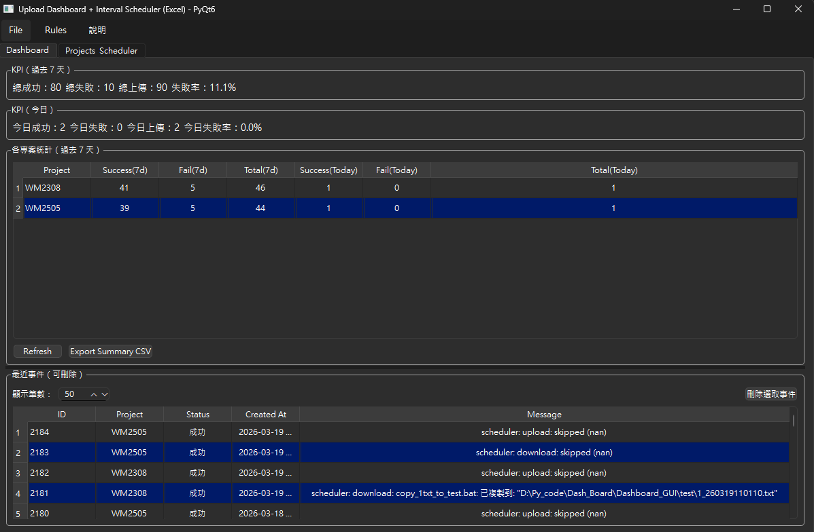

# UploadDashboard

一套以 **PyQt** 製作的 Windows GUI 工具，用於執行「**Download → Upload**」兩階段任務、產生日誌並將錯誤自動對應為 **error code**。  
專案支援以 **外部 CSV（`error_keywords.csv`）** 方式管理錯誤碼對應，無須改動程式即可擴充／覆蓋規則；並提供「**規則**」選單與「**關於**」對話框。

<p align="center">
  
</p>

---

## 目錄
- [功能特性](#功能特性)
- [系統需求](#系統需求)
- [安裝與執行](#安裝與執行)
- [打包為 .exe（建議 One Directory）](#打包為-exe建議-one-directory)
- [錯誤碼規則：`error_keywords.csv`](#錯誤碼規則-error_keywordscsv)
- [事件日誌格式（CSV Schema）](#事件日誌格式csv-schema)
- [版本與相容性](#版本與相容性)
- [常見問題](#常見問題)
- [貢獻](#貢獻)
- [授權](#授權)

---

## 功能特性

- **兩階段流程**：`download` → `upload`，每一步皆寫入事件日誌（CSV），並於 GUI 顯示結果。
- **錯誤碼外部化**：以 **`error_keywords.csv`**（兩欄：`error_code,keyword`）維護「訊息 → 代碼」對應。  
  - 規則可**熱載**（無須重啟程式）。  
  - **由上而下第一筆命中即用**、**不分大小寫**、**包含即命中**。
- **未定義錯誤提醒**：`status=fail` 且未命中任何自訂或內建規則時，自動指派 **`E000`** 並跳出提醒，提供一鍵開啟 `error_keywords.csv` 新增規則。
- **UI 選單**  
  - **規則**：開啟關鍵字規則檔、重新載入、規則說明  
  - **說明 → 關於**：顯示目前版本、可一鍵開啟 `CHANGELOG.md`
- **日誌輸出**：每日一檔，檔名格式：`<Project>_YYYYMMDD.csv`（預設位置可依專案設定，例如：`D:\<Project>\logs\`）。
- **建議打包**：One Directory（`onedir`），避免把 `error_keywords.csv` 綁入 exe，利於使用者維護。

---

## 系統需求

- Windows 10/11
- Python 3.8+（開發／不打包時）
- 主要套件（開發態）：`PyQt6`, `pandas`（其餘請見 `requirements.txt`）

> 若使用打包版 `.exe`，不需安裝 Python。

---

## 安裝與執行

### 方式 A：以原始碼執行（開發態）

```bash
# (建議) 於專案根目錄建立虛擬環境
python -m venv .venv
.venv\Scripts\activate

# 安裝套件
pip install -r requirements.txt

# 啟動
python app.py
